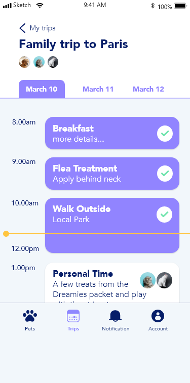
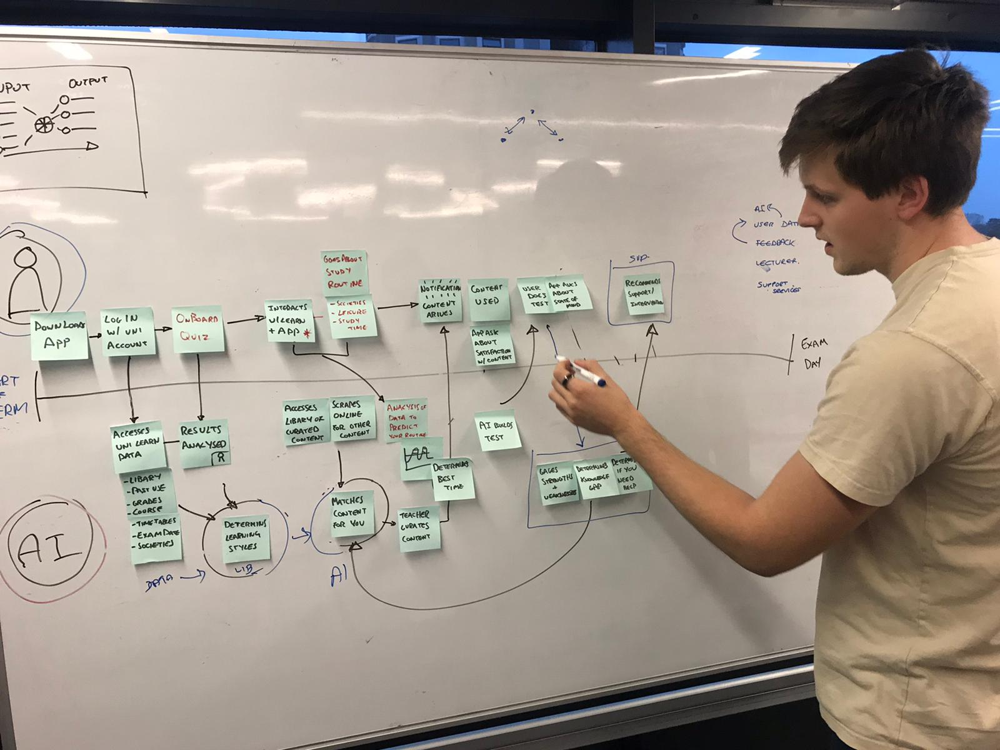

	<!-- 

 -->
    <!-- <section class="main" id="main">
        <container class="grid-container">
		

			<a class="btn" href="../static/Thomas-Mott-UX-portfolio.pdf" download="portfolio">download portfolio</a>
			
		

		

			

				
				
				
			

			

				

					

						<h1>Mojeek</h1>
						
<em>Discipline learned: user experience design, user interface design, frontend development, user researching</em>

						
Assessment metrics for the Ralph Lauren website were conducted using expert review, satisfaction and performance assessments.Tests run on the site included:Heuristic analysis, Task Time, User Errors, User Efficiency (lostness), Thematic analysis, Biometrics (eye tracking), Think aloud & SUS

					

					

						<h2>About</h2>
						
I am lead UX / UI and a frontend developer at Mojeek.com

						
I organise and conduct UX testing, run accessibility audits and heuristic analysis.

						
I have designed, built and am implementing a css framework to make page building easier.

						
I have created marketing graphics, UI mockups and have implmented them across all aspects of the website.

					

				

			

		

		

		

			

				
				
				
			

			

			

		

		

			

				
				
				
			

			

				

					

						<h1>Recoll</h1>
						
<em>Disciplines: designing for AI, groupworking, experience design</em>

						
The university experience needs to be adjusted to make students more ready for industry 4.0.This project looked to solve meaningful issue, defined through detailed uer centred research, for education 4.0 using Artificial Intelligence. This was a 3 month long team project, in which I led the analytical and artificail intelligence modelling.

					

					

						<h2>Approach</h2>
						
The design process followed the double diamond, the biggest focus for this project was providing value to users as well as making sure that the final output was feasable for developers. This required a lot of multidisciplinary team working.

						<h2>Testing</h2>
						
Initial wire-frame were sketched out so I had an idea of how the app would flow. These were tested with body-storming.This was then transferred into Adobe XD to create something more interactive and tangible.To make sure the prototype was suited to my research participant I sat down an observed them, noting down key information.

						<h2>Goals</h2>
						
The main goal of the project was to improve the university experience for those who were not feeling supported. The greatest challenge of the project was enabling the individual without having a negative impact on the existing services. Making sure the AI was relevant and that data was handled ethically were also primary concerns.

						<h2>Outcome</h2>
						
User testing showed that there was a lot of benefit to the project.

					

				

			

		

        </container>
    </section>
	
 -->
